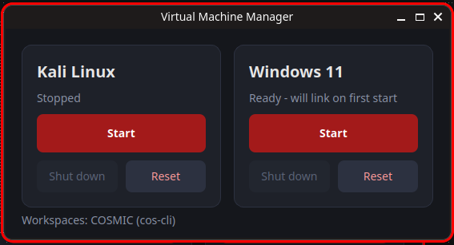

# VM Lab

> **Made for Pop!_OS Linux with the COSMIC desktop environment**

A PyQt6 desktop application for launching disposable virtual machines on top of **libvirt** with a single click.



## Features

- **One-click VM launch** — Start Kali Linux or Windows 11 VMs instantly
- **Disposable overlays** — Each session boots from a thin qcow2 overlay on top of a read-only "golden" base image. Reset = delete the overlay and recreate it
- **Workspace isolation** — Each VM opens on its own virtual desktop (KDE Plasma, COSMIC, or X11 via `wmctrl`)
- **Auto-attach viewer** — `virt-viewer` launches fullscreen and is automatically pinned to the VM's workspace
- **Stateful sessions** — Switch back to your launcher desktop while the VM keeps running; close the viewer to return to your workspace

## Requirements

```bash
sudo apt install python3-pyqt6 virt-viewer libvirt-clients qemu-utils
```

Optional (X11 fallback for non-KDE desktops):
```bash
sudo apt install wmctrl
```

## Setup

1. **Create your golden base images** (read-only):
   ```
   ~/virt-machines/images/kali_disk.qcow2
   ~/virt-machines/images/windows11_disk.qcow2
   ```

2. **Define the VMs in libvirt** (via `virt-manager` or `virsh`). The application will auto-detect them, or you can link manually on first launch.

3. **Ensure your user is in the `libvirt` group**:
   ```bash
   sudo usermod -aG libvirt $USER
   ```
   Log out and back in for the group change to take effect.

4. **Run the application**:
   ```bash
   python3 main.py
   ```

## How It Works

```
Base Image (read-only)          Overlay (writable, per-session)
┌──────────────────┐           ┌──────────────────┐
│  kali_disk.qcow2 │  ──copy──>│  kali_live.qcow2 │
│  (golden)        │  snapshot │  (changes only)  │
└──────────────────┘           └──────────────────┘
```

- **Start** — Creates (or reuses) an overlay, switches to a new virtual desktop, and launches `virt-viewer` fullscreen
- **Shut down** — Powers off the VM via `virsh destroy`
- **Reset** — Deletes the overlay and recreates it from the base image, returning the VM to its pristine state

## Configuration

Edit the constants at the top of `main.py` if your setup differs:

| Setting | Default | Description |
|---|---|---|
| `LIBVIRT_URI` | `qemu:///system` | Use `qemu:///session`) for user-session VMs |
| `IMAGE_DIR` | `~/virt-machines/images` | Directory containing base and overlay images |
| `CONFIG_FILE` | `~/.config/vm-lab/config.json` | Remembers which libvirt domain belongs to each VM |

## Desktop Environment Support

| Desktop | Backend | Requirement |
|---|---|---|
| **Pop-OS-COSMIC** (Wayland) | `cos-cli` | `cargo install cos-cli` |
| KDE Plasma (X11/Wayland) | KWin D-Bus | Built-in |
| X11 (GNOME, XFCE, etc.) | `wmctrl` | `sudo apt install wmctrl` |

The application auto-detects your desktop environment and displays the status at the bottom of the window.

## Architecture

```
main.py
├── VM definitions (VMS dict)
├── libvirt helpers (virsh, qemu-img)
├── Workspace backends
│   ├── KDEWorkspaces (KWin D-Bus)
│   ├── WmctrlWorkspaces (X11)
│   └── CosmicWorkspaces (cos-cli)
├── Config manager (JSON)
└── PyQt6 GUI (Launcher, Card widgets)
```

## Troubleshooting

- **"Base image not found"** — Ensure the qcow2 file exists at the path specified by `IMAGE_DIR`
- **"No libvirt VM uses..."** — Create the VM in `virt-manager` first, or link manually on first launch
- **"Viewer window never appeared"** — Give `virt-viewer` a moment to create its window; the app retries for ~10 seconds
- **COSMIC dynamic workspaces** — Enable "Dynamic Workspaces" in COSMIC Settings for the best experience
